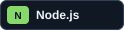
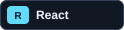
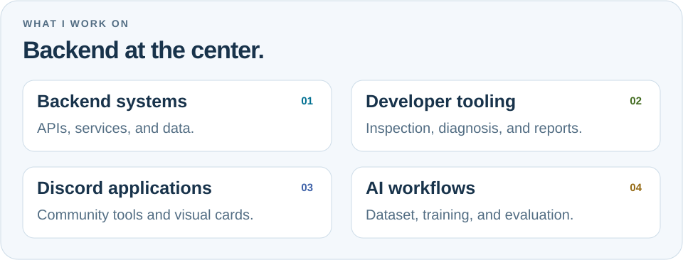
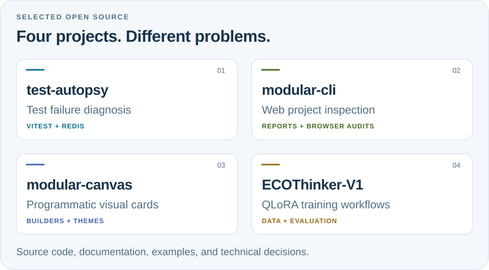
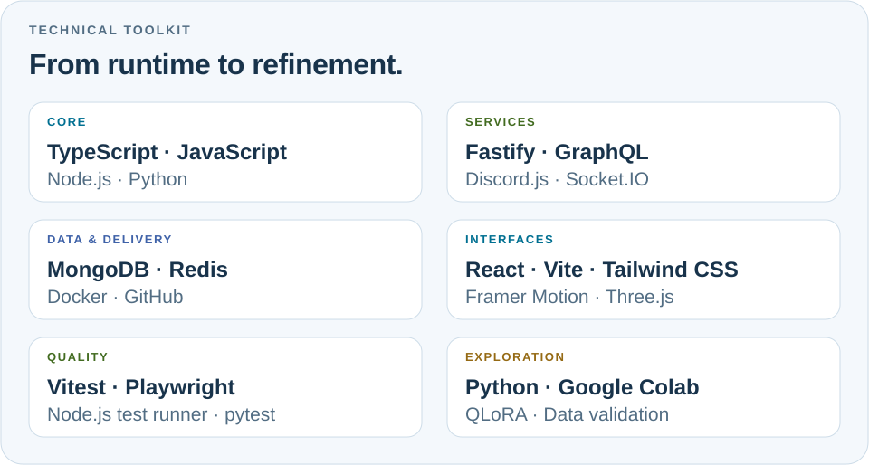
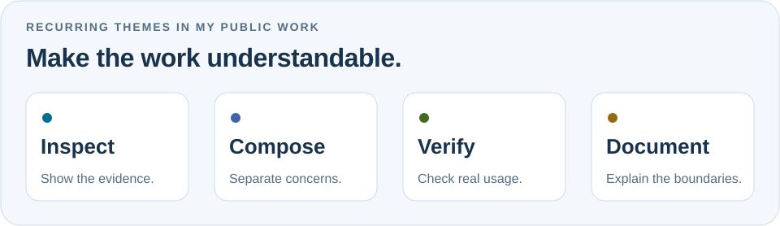
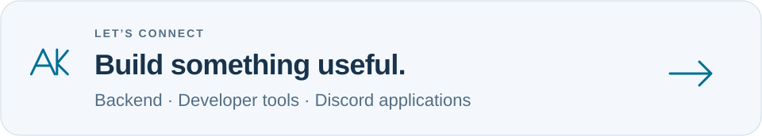

# Building useful things, from the backend outward.

**Ataberk Koç · Backend Developer · Antalya, Türkiye**

I build developer tools, backend software, and reusable components. 
My projects connect a practical problem with code you can inspect, run, and understand.

[Projects](#selected-projects) · [Toolkit](#my-toolkit) · [Approach](#how-i-work) · [Connect](#lets-connect)

  
  
  
  
  
  

[GitHub](https://github.com/manyZXZ) · [Modique](https://modiqueps.com) · [Email](mailto:contact@modiqueps.com)

## A little about me

I'm Ataberk, also known as **manyZXZ**. My starting point is backend development: application behavior, data, integrations, and the tools that make those systems easier to work with.

I also enjoy the visual side of software. That interest shows up in canvas components, Discord experiences, and interfaces that make technical information easier to read.

Across my public projects, you'll find a mix of **developer tooling**, **Node.js libraries**, and **Python experiments**. I care about clear boundaries, reusable building blocks, and documentation that helps someone take the next step without guessing.

| At a glance | Details |
| :--- | :--- |
| **Based in** | Antalya, Türkiye |
| **Primary focus** | Backend development and developer tools |
| **Main ecosystem** | TypeScript, JavaScript, and Node.js |
| **Also exploring** | Python, reproducible model training, and visual tooling |
| **Community project** | [Modique](https://modiqueps.com) |
| **Away from the editor** | Football |

## Where my work meets

<picture>
  <source media="(prefers-color-scheme: dark)" srcset="assets/profile-focus-dark.svg">
  
</picture>

| Area | What interests me |
| :--- | :--- |
| **Backend systems** | APIs, data access, service integrations, and behavior that can be tested. |
| **Developer tools** | Turning debugging and review work into repeatable, inspectable workflows. |
| **Discord experiences** | Bot integrations, reusable cards, and configurable visual components. |
| **AI experiments** | Reproducible training pipelines, dataset checks, and explicit evaluation steps. |

The connection between them is simple: I like building things that help someone understand a system or get useful work done.

## Selected projects

<picture>
  <source media="(prefers-color-scheme: dark)" srcset="assets/profile-projects-dark.svg">
  
</picture>

<table>
  <tr>
    <td width="50%" valign="top">
      <h3><a href="https://github.com/manyZXZ/test-autopsy">Test Autopsy</a></h3>
      
<strong>Make a failing test order explainable.</strong>

      
Investigates Vitest failures that appear when files run together. It reduces the predecessor sequence, records Redis state changes, and checks whether restoring candidate keys lets the target test pass.

      
<code>TypeScript</code> <code>Node.js</code> <code>Vitest</code> <code>Redis</code>

      
<strong>Current scope:</strong> a developer preview for sequential Vitest files and dedicated Redis namespaces.

      
<a href="https://github.com/manyZXZ/test-autopsy">Repository →</a> · <a href="https://github.com/manyZXZ/test-autopsy/blob/main/docs/example-report.md">Example evidence</a> · <a href="https://github.com/manyZXZ/test-autopsy/blob/main/docs/methodology.md">Methodology</a>

    </td>
    <td width="50%" valign="top">
      <h3><a href="https://github.com/manyZXZ/modular-cli">Modular CLI</a></h3>
      
<strong>Review a web project with evidence you can follow.</strong>

      
A local CLI for security, accessibility, SEO, and website quality review. Findings connect to source locations and suggested fixes; an optional browser audit adds evidence from the rendered page.

      
<code>JavaScript</code> <code>Node.js</code> <code>Playwright</code> <code>Axe</code>

      
<strong>Design choice:</strong> static scans require no AI model, API key, or runtime dependencies.

      
<a href="https://github.com/manyZXZ/modular-cli">Repository →</a> · <a href="https://github.com/manyZXZ/modular-cli/blob/main/docs/README.md">Documentation</a> · <a href="https://github.com/manyZXZ/modular-cli/blob/main/docs/coverage.md">Coverage</a>

    </td>
  </tr>
  <tr>
    <td width="50%" valign="top">
      <h3><a href="https://github.com/manyZXZ/modular-canvas">Modular Canvas</a></h3>
      
<strong>Give reusable components a visual language.</strong>

      
A Node.js canvas library for themed Discord cards. Builder APIs separate card data from presentation, with support for profile, rank, music, leaderboard, invite, and welcome cards.

      
<code>JavaScript</code> <code>TypeScript definitions</code> <code>@napi-rs/canvas</code>

      
<strong>Design choice:</strong> configurable themes and composable APIs for different card types.

      
<a href="https://github.com/manyZXZ/modular-canvas">Repository →</a> · <a href="https://github.com/manyZXZ/modular-canvas/tree/main/docs/getting-started">Getting started</a> · <a href="https://github.com/manyZXZ/modular-canvas/tree/main/docs/examples">Examples</a>

    </td>
    <td width="50%" valign="top">
      <h3><a href="https://github.com/manyZXZ/ECOThinker-V1">ECOThinker V1</a></h3>
      
<strong>Make model experiments reproducible.</strong>

      
A Python and Colab workflow for QLoRA fine-tuning with Qwen3.5-4B. The repository includes training configuration, dataset validation, reviewable notebooks, and release gates.

      
<code>Python</code> <code>Jupyter</code> <code>Google Colab</code> <code>QLoRA</code>

      
<strong>Current scope:</strong> training pipelines and validation; public model weights have not been released.

      
<a href="https://github.com/manyZXZ/ECOThinker-V1">Repository →</a> · <a href="https://github.com/manyZXZ/ECOThinker-V1/blob/main/docs/DATASET.md">Dataset contract</a> · <a href="https://github.com/manyZXZ/ECOThinker-V1/blob/main/docs/RELEASE.md">Release process</a>

    </td>
  </tr>
</table>

### Find a useful starting point

| If you're interested in… | Start here |
| :--- | :--- |
| A test that passes alone but fails in a sequence | [Test Autopsy's captured example](https://github.com/manyZXZ/test-autopsy/blob/main/docs/example-report.md) |
| Local checks for a web application before release | [Modular CLI's getting-started guide](https://github.com/manyZXZ/modular-cli/blob/main/docs/getting-started.md) |
| Building themed cards for a Discord integration | [Modular Canvas examples](https://github.com/manyZXZ/modular-canvas/tree/main/docs/examples) |
| Dataset preparation and repeatable model experiments | [ECOThinker V1's dataset contract](https://github.com/manyZXZ/ECOThinker-V1/blob/main/docs/DATASET.md) |

## My toolkit

<picture>
  <source media="(prefers-color-scheme: dark)" srcset="assets/profile-stack-dark.svg">
  
</picture>

**TypeScript, JavaScript, and Node.js** sit at the center of my work. I use the surrounding ecosystem to move between backend behavior, reusable APIs, automated checks, and the interfaces that make a project usable.

Python gives me another workspace for data validation and training experiments. For visual work, I combine web technologies with canvas rendering and Discord integrations.

<strong>Languages and foundations</strong>

| Technology | Where it fits |
| :--- | :--- |
| **TypeScript** | Typed application code, contracts, and reusable APIs. |
| **JavaScript** | Node.js packages, command-line tools, and web behavior. |
| **Python** | Data checks, training utilities, and experimentation. |
| **HTML & CSS** | Structure, semantics, and visual presentation. |

<strong>Backend, data, and integrations</strong>

| Technology | Where it fits |
| :--- | :--- |
| **Node.js** | The runtime behind my JavaScript tooling and libraries. |
| **Fastify** | HTTP services and backend APIs. |
| **MongoDB** | Document-oriented application data. |
| **Redis / ioredis** | Shared state, application integrations, and test-state investigation. |
| **GraphQL** | Structured API queries and schemas. |
| **Socket.IO** | Event-driven client and server communication. |
| **Discord.js** | Discord bot features and platform integrations. |

<strong>Interfaces and visual components</strong>

| Technology | Where it fits |
| :--- | :--- |
| **React** | Component-based interfaces. |
| **Vite** | Frontend development and build workflows. |
| **Tailwind CSS** | Consistent interface styling. |
| **Framer Motion** | Motion and interaction in web interfaces. |
| **Three.js** | Browser-based 3D experiences. |
| **@napi-rs/canvas** | Programmatic graphics and reusable card rendering. |

<strong>Testing, delivery, and experiments</strong>

| Technology | Where it fits |
| :--- | :--- |
| **Vitest / Jest** | Automated checks in JavaScript and TypeScript projects. |
| **Playwright / Axe** | Browser evidence and accessibility checks. |
| **Docker** | Repeatable local services and development environments. |
| **Git / GitHub** | Version control, project documentation, and collaboration. |
| **npm** | Package workflows and JavaScript tooling. |
| **Jupyter / Google Colab** | Reviewable notebooks and training experiments. |
| **QLoRA** | Parameter-efficient fine-tuning workflows. |

## How I work

<picture>
  <source media="(prefers-color-scheme: dark)" srcset="assets/profile-principles-dark.svg">
  
</picture>

### Inspect the problem

I want a tool's output to lead back to something concrete: a source location, a state change, or a reproducible example. Test Autopsy's Redis evidence and Modular CLI's findings reflect that preference.

### Compose the solution

Small interfaces make software easier to reuse. Modular Canvas explores this through builder APIs, themes, and a separation between the data a card carries and the way it looks.

### Verify behavior

Tests, repeatable fixtures, and explicit checks help define what a project actually supports. I prefer examples someone can rerun and limits they can inspect alongside the implementation.

### Document the result

Setup instructions, examples, configuration references, and troubleshooting are part of the project. A useful README should help someone decide whether a tool fits their problem and get to a first working result.

## Alongside open source: Modique

I also work on **Modique**, the project connected to my website and community channels. It sits alongside my interest in backend development, Discord integrations, and visual components.

| Explore Modique | Link |
| :--- | :--- |
| **Website** | [modiqueps.com](https://modiqueps.com) |
| **Community** | [Discord](https://discord.gg/modique) |
| **Updates** | [Instagram](https://instagram.com/modiqueps) |
| **Contact** | [contact@modiqueps.com](mailto:contact@modiqueps.com) |

## Things I'd enjoy discussing

- **Developer tooling:** recurring debugging or review tasks that could become a useful, focused tool.
- **Backend behavior:** state, integrations, and practical ways to make failures easier to investigate.
- **Reusable components:** APIs that support customization without making simple use cases complicated.
- **Reproducible experiments:** clear inputs, data checks, evaluation, and understandable outputs.
- **Documentation:** examples and explanations that help the next developer move forward.

For a project-specific question or bug, its repository is the best place to keep the context together. A small reproduction, expected behavior, and relevant environment details make technical conversations much more useful.

## Let's connect

<a href="mailto:contact@modiqueps.com">
<picture>
  <source media="(prefers-color-scheme: dark)" srcset="assets/profile-connect-dark.svg">
  
</picture>
</a>

**Have a concrete problem, a useful idea, or feedback on a project?**

[Explore my repositories](https://github.com/manyZXZ?tab=repositories) · [Visit Modique](https://modiqueps.com) · [Send an email](mailto:contact@modiqueps.com)

[Discord community](https://discord.gg/modique) · [Instagram](https://instagram.com/modiqueps)

Ataberk Koç · manyZXZ · Antalya, Türkiye

