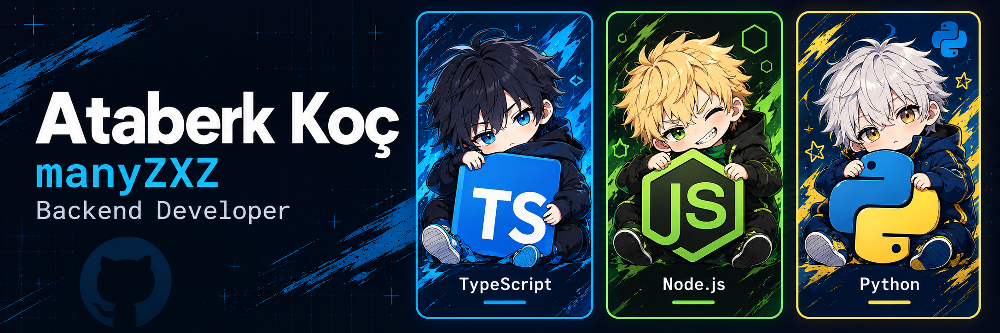

# Ataberk

**Backend Developer · Antalya, Türkiye**

[Projects](#projects) · [Stack](#stack) · [Contact](#contact)

I'm Ataberk, or **manyZXZ** here on GitHub. I work mostly with **TypeScript, JavaScript, and Node.js**. My projects range from tools for debugging and reviewing code to libraries for Discord cards. I've also been working with Python on a model fine-tuning pipeline.

## Projects

<table>
  <tr>
    <td width="50%" valign="top">
      <h3><a href="https://github.com/manyZXZ/test-autopsy">Test Autopsy</a></h3>
      
A tool for Vitest tests that pass alone but fail after other tests. It narrows down the preceding files, records Redis changes, and checks whether restoring candidate keys makes the target test pass.

      
The developer preview supports sequential Vitest files and dedicated Redis namespaces.

      
<code>TypeScript</code> <code>Vitest</code> <code>Redis</code>

      
<a href="https://github.com/manyZXZ/test-autopsy">Code ↗</a> · <a href="https://github.com/manyZXZ/test-autopsy/blob/main/docs/example-report.md">Example report</a>

    </td>
    <td width="50%" valign="top">
      <h3><a href="https://github.com/manyZXZ/modular-cli">Modular CLI</a></h3>
      
A local CLI for security, accessibility, SEO, and website quality checks. Findings include source locations and suggested fixes. Optional Playwright and Axe audits inspect the rendered page.

      
The static scanner has no runtime dependencies and needs no API key.

      
<code>JavaScript</code> <code>Node.js</code> <code>Playwright</code>

      
<a href="https://github.com/manyZXZ/modular-cli">Code ↗</a> · <a href="https://github.com/manyZXZ/modular-cli/blob/main/docs/getting-started.md">Get started</a>

    </td>
  </tr>
  <tr>
    <td width="50%" valign="top">
      <h3><a href="https://github.com/manyZXZ/modular-canvas">Modular Canvas</a></h3>
      
A Node.js library for customizable Discord cards: profiles, ranks, music, leaderboards, invites, and welcomes. Builder APIs keep card data separate from themes and layout.

      
Includes TypeScript definitions and examples for themes and Discord integrations.

      
<code>JavaScript</code> <code>Node.js</code> <code>@napi-rs/canvas</code>

      
<a href="https://github.com/manyZXZ/modular-canvas">Code ↗</a> · <a href="https://github.com/manyZXZ/modular-canvas/tree/main/examples">Examples</a>

    </td>
    <td width="50%" valign="top">
      <h3><a href="https://github.com/manyZXZ/ECOThinker-V1">ECOThinker V1</a></h3>
      
A Python and Colab workflow for QLoRA fine-tuning with Qwen3.5-4B. Includes dataset validation, training configuration, notebooks, and checks for preparing a release.

      
The training pipeline is public; model weights haven't been released.

      
<code>Python</code> <code>Google Colab</code> <code>QLoRA</code>

      
<a href="https://github.com/manyZXZ/ECOThinker-V1">Code ↗</a> · <a href="https://github.com/manyZXZ/ECOThinker-V1/blob/main/docs/DATASET.md">Dataset guide</a>

    </td>
  </tr>
</table>

<strong>Technical notes & documentation</strong>

| Project | A closer look |
| :--- | :--- |
| **Test Autopsy** | [How the reduction and restore checks work](https://github.com/manyZXZ/test-autopsy/blob/main/docs/methodology.md) |
| **Modular CLI** | [Available checks and their limits](https://github.com/manyZXZ/modular-cli/blob/main/docs/coverage.md) |
| **Modular Canvas** | [Installation and your first card](https://github.com/manyZXZ/modular-canvas/tree/main/docs/getting-started) |
| **ECOThinker V1** | [Evaluation and release checklist](https://github.com/manyZXZ/ECOThinker-V1/blob/main/docs/RELEASE.md) |

## Stack

Most of my work is in the Node.js ecosystem. I use Python for data checks and training experiments, and React when a project needs a web interface.

**Languages & runtime**

  
  
  
  

**Backend & data**

  
  
  
  
  
  

**Interfaces**

  
  
  

**Development & testing**

  
  
  
  

## Beyond code

I also work on **[Modique](https://modiqueps.com)**. You can find the community on [Discord](https://discord.gg/modique) and follow along on [Instagram](https://instagram.com/modiqueps). Away from the editor, I follow football.

## Contact

For bugs or questions about a project, open an issue in its repository. You can reach me directly at **[contact@modiqueps.com](mailto:contact@modiqueps.com)**.

[GitHub](https://github.com/manyZXZ) · [Modique](https://modiqueps.com) · [Discord](https://discord.gg/modique) · [Instagram](https://instagram.com/modiqueps)

